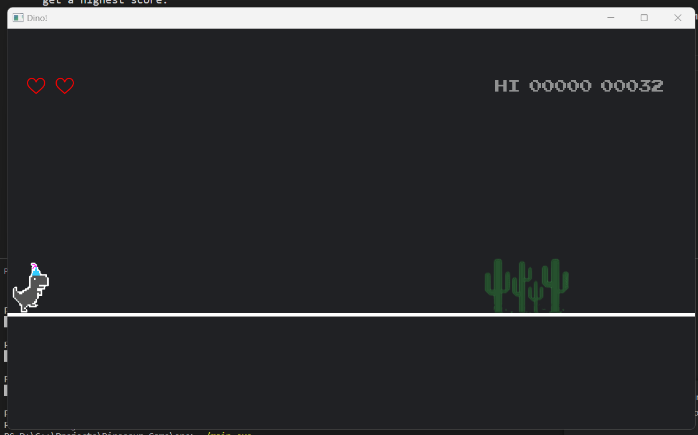

# Dinosaur-Game

- It is a simple Dino Game in C++ using **SFML**.
- I created this project with the goal of learning and practicing the **SFML** graphics library, as well as developing my skills in designing a simple game. This game has all the fundamental features of the original Chrome Dino game.

## Installation

To install this project for *Visual Studio Code*, you can follow these steps:
* Clone this repository to your machine
* `Settings` → `Extensions` → `C/C++` → `C_Cpp › Default: Include Path`
* Use the path where you save this project to `Add item`, for example:
    

Install **SFML** for Visual Studio Code:
- https://www.youtube.com/watch?v=rZE700aaT5I
- https://www.youtube.com/watch?v=Re5QCCvE0CM

## Usage

* Run the command `cd src` 
* Run the command `make` to build the source code (or maybe `mingw32_make` if that doesn't work)
* Run the file `main.exe` to start the game
    

## Technologies

[SFML](https://www.sfml-dev.org/tutorials/2.6/)

